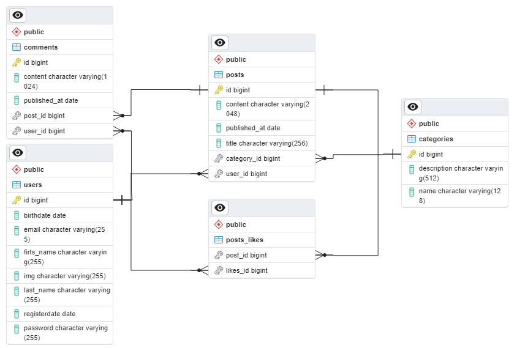

# Blog Spring Boot Monolithic Rest API Project
## Project Description
This project represents a blogging platform where users can blog, read and comment on posts. 
It includes basic features such as user registration, post creation and publishing, search and categorization. 
The project is based on the Restful API.
<br>
## Project in General Terms
In general terms, this project represents a structure that simulates the endpoints of a blog page.
This structure was created using Spring Boot. The endpoints, their usage and return values are specified 
under the [Endpoints](#Endpoints) heading and the error trapping structure is used in the project.
In general terms, the error structure has the following return; code and message.
```json
{
  "code": 0,
  "message": "string"
}
 ```
Error codes represent general project errors in case of 1XXX and User class specific errors in case of 2XXX.
In addition, in case of unexpected errors, 9999 error codes are returned.
## Project Technologies
* Java 17
* Spring Boot **2.7.17**
* Spring Data JPA **2.7.17**
* PostgreSQL
* Gradle
* Monolithic architecture
<br>
## Database
Database parameters in the _application.yml_ file.
```yml
spring:
  datasource:
    driver-class-name: org.postgresql.Driver
    url: jdbc:postgresql://localhost:5432/blogdb
    username: postgres
    password: 1234
```
Database Entity-Relationship Diagram(ERD)

## Endpoints
### User
* **GET** /api/v1/users/{userId} --> `ResponseEntity<UserResponseDto> findById(@PathVariable Long userId)`
  * **Request  :** 
    * **Parameters :** _userId(int64)(Path)_
  * **Response :** 
  ```json
      {
        "firstname": "string",
        "lastname": "string",
        "email": "string",
        "img": "string",
        "birthdate": "2023-11-24",
        "registerdate": "2023-11-24"
      }
  ```
* **PUT** /api/v1/users/{userId} --> `ResponseEntity<UserResponseDto> update(@PathVariable Long userId, @RequestBody PutRequestDto dto)`
    * **Request  :**
      * **Parameters :** _userId(int64)(Path)_
      * **Request Body :** 
      ```json
          {
            "id": 0,
            "fields": {
                "additionalProp1": {},
                "additionalProp2": {},
                "additionalProp3": {}
            }
          }
      ```
    * **Response :**
  ```json
      {
        "firstname": "string",
        "lastname": "string",
        "email": "string",
        "img": "string",
        "birthdate": "2023-11-24",
        "registerdate": "2023-11-24"
      }
  ```
* **DELETE** /api/v1/users/{userId} --> `ResponseEntity<String> delete(@PathVariable Long userId)`
    * **Request  :**
        * **Parameters :** _userId(int64)(Path)_
    * **Response :** string
* **GET** /api/v1/users --> `ResponseEntity<List<UserResponseDto>> findAll()`
    * **Response :**
  ```json
      {
        "firstname": "string",
        "lastname": "string",
        "email": "string",
        "img": "string",
        "birthdate": "2023-11-24",
        "registerdate": "2023-11-24"
      }
  ```
* **POST** /api/v1/users --> `ResponseEntity<String> save(@RequestBody @Validated CreateUserRequestDto dto)`
    * **Request  :**
        * **Request Body :**
        ```json
          {
            "firstname": "string",
            "lastname": "string",
            "email": "string",
            "password": "string",
            "rePassword": "string",
            "img": "string",
            "birthdate": "2023-11-24"
          }
      ```
    * **Response :** string
* **POST** /api/v1/users/login --> `RedirectView login(@Validated @RequestParam String email, @RequestParam String password)`
    * **Request  :**
      * **Parameters :** 
        1. _email(string)(query)_
        2. _password(string)(query)_
    * **Response :** homepage.html
### Post
* **GET** /api/v1/posts/{postId} --> `ResponseEntity<PostResponseDto> findById(@PathVariable Long postId)`
    * **Request  :**
      * **Parameters :** _postId(int64)(Path)_
    * **Response :**
  ```json
    {
      "title": "string",
      "content": "string",
      "publishedAt": "2023-11-24",
      "userLikes": [
        "string"
      ],
      "userName": "string",
      "categoryName": "string"
    }
  ```
* **PUT** /api/v1/posts/{postId} --> `ResponseEntity<PostResponseDto> update(@PathVariable Long postId, @RequestBody PutRequestDto dto)`
    * **Request  :**
      * **Parameters :** _postId(int64)(Path)_
      * **Request Body :**
      ```json
          {
            "id": 0,
            "fields": {
                "additionalProp1": {},
                "additionalProp2": {},
                "additionalProp3": {}
            }
          }
      ```
    * **Response :**
  ```json
    {
      "title": "string",
      "content": "string",
      "publishedAt": "2023-11-24",
      "userLikes": [
        "string"
      ],
      "userName": "string",
      "categoryName": "string"
    }
  ```
* **DELETE** /api/v1/posts/{postId} --> `ResponseEntity<String> delete(@PathVariable Long postId)`
    * **Request  :**
      * **Parameters :** _postId(int64)(Path)_
    * **Response :** string
* **GET** /api/v1/posts --> `ResponseEntity<List<PostResponseDto>> findAll()`
    * **Request  :**
        * **Parameters :** _publishedAt(LocalDate)(query)(optional)_
    * **Response :**
  ```json
    {
      "title": "string",
      "content": "string",
      "publishedAt": "2023-11-24",
      "userLikes": [
        "string"
      ],
      "userName": "string",
      "categoryName": "string"
    }
  ```
* **POST** /api/v1/posts --> `ResponseEntity<String> createPost(@RequestBody CreatePostRequestDto dto)`
    * **Request  :**
      * **Request Body :**
      ```json
          {
            "title": "string",
            "content": "string",
            "categoryName": "string",
             "userEmail": "string"
          }
      ```
    * **Response :** string
* **GET** /api/v1/posts/{postId}/{userId} --> `ResponseEntity<String> likePost(@PathVariable Long postId, @PathVariable Long userId)`
    * **Request  :**
      * **Parameters :**
        1. _postId(int64)(path)_
        2. _userId(int64)(path)_
    * **Response :** string
* **GET** /api/v1/posts/user/{userId} --> `ResponseEntity<List<PostResponseDto>> findAllByUserId(@PathVariable Long userId)`
    * **Request  :**
      * **Parameters :** _userId(int64)(path)_
    * **Response :**
  ```json
    {
      "title": "string",
      "content": "string",
      "publishedAt": "2023-11-24",
      "userLikes": [
        "string"
      ],
      "userName": "string",
      "categoryName": "string"
    }
  ```
* **GET** /api/v1/posts/search --> `ResponseEntity<List<PostResponseDto>> findAllByWord(String q)`
    * **Request  :**
      * **Parameters :** _q(string)(query)_
    * **Response :**
  ```json
    {
      "title": "string",
      "content": "string",
      "publishedAt": "2023-11-24",
      "userLikes": [
        "string"
      ],
      "userName": "string",
      "categoryName": "string"
    }
  ```
* **GET** /api/v1/posts/search/category --> `ResponseEntity<List<PostResponseDto>> findAllByCategoryName(String categoryName)`
    * **Request  :**
      * **Parameters :** _categoryName(string)(query)_
    * **Response :**
  ```json
    {
      "title": "string",
      "content": "string",
      "publishedAt": "2023-11-24",
      "userLikes": [
        "string"
      ],
      "userName": "string",
      "categoryName": "string"
    }
  ```
* **GET** /api/v1/posts/category/{categoryId} --> `ResponseEntity<List<PostResponseDto>> findAllByCategoryId(@PathVariable Long categoryId)`
    * **Request  :**
      * **Parameters :** _categoryId(int64)(path)_
    * **Response :**
  ```json
    {
      "title": "string",
      "content": "string",
      "publishedAt": "2023-11-24",
      "userLikes": [
        "string"
      ],
      "userName": "string",
      "categoryName": "string"
    }
  ```
### Category
* **GET** /api/v1/categories/{categoryId} --> `ResponseEntity<CategoryResponseDto> findById(@PathVariable Long categoryId)`
    * **Request  :**
      * **Parameters :** _categoryId(int64)(path)_
    * **Response :**
  ```json
    {
      "name": "string",
      "description": "string"
    }
  ```
* **PUT** /api/v1/categories/{categoryId} --> `ResponseEntity<CategoryResponseDto> update(@PathVariable Long categoryId, @RequestBody PutRequestDto dto)`
    * **Request  :**
      * **Parameters :** _categoryId(int64)(path)_
      * **Request Body :**
      ```json
          {
            "id": 0,
            "fields": {
                "additionalProp1": {},
                "additionalProp2": {},
                "additionalProp3": {}
            }
          }
      ```
    * **Response :**
  ```json
    {
      "name": "string",
      "description": "string"
    }
  ```
* **DELETE** /api/v1/categories/{categoryId} --> `ResponseEntity<String> delete(@PathVariable Long categoryId)`
    * **Request  :**
      * **Parameters :** _categoryId(int64)(path)_
    * **Response :** string
* **GET** /api/v1/categories --> `ResponseEntity<List<CategoryResponseDto>> findAll()`
    * **Request  :**
        * **Parameters :** _name(String)(query)(optional)_
    * **Response :**
  ```json
    {
      "name": "string",
      "description": "string"
    }
  ```
* **POST** /api/v1/categories --> `ResponseEntity<String> save(@RequestBody CreateCategoryRequestDto dto)`
    * **Request  :**
      * **Request Body :**
      ```json
          {
            "name": "string",
            "description": "string"
          }
      ```
    * **Response :** string
### Comment
* **POST** /api/v1/comments --> `ResponseEntity<String> save(@RequestBody CreateCommentRequestDto dto)`
    * **Request  :**
      * **Request Body :**
      ```json
          {
            "userEmail": "string",
            "content": "string",
            "postId": 0
          }
      ```
    * **Response :** string
* **DELETE** /api/v1/comments/{commentId} --> `ResponseEntity<String> delete(@PathVariable Long commentId)`
    * **Request  :**
      * **Parameters :** _categoryId(int64)(path)_
    * **Response :** string
## Auxiliary Resources
* [Home Page HTML](https://www.w3schools.com/html/default.asp)
* [Validation Password](https://www.baeldung.com/registration-password-strength-and-rules)
  * Some restrictions have been added to the password the user enters when registering. Customized annotation has been added for the control of these restrictions.
  ```java
    @Documented
    @Constraint(validatedBy = PasswordConstraintValidator.class)
    @Target({ TYPE, FIELD, ANNOTATION_TYPE })
    @Retention(RUNTIME)
    public @interface ValidPassword {

        String message() default "Invalid Password";
        Class<?>[] groups() default {};
        Class<? extends Payload>[] payload() default {};
  
    }
    ```
  * This annotation is used in the PasswordConstraintValidator helper class to create constraints.
  ```java
    public class PasswordConstraintValidator implements ConstraintValidator<ValidPassword, String> {

        @Override
        public boolean isValid(String password, ConstraintValidatorContext context) {
            PasswordValidator validator = new PasswordValidator(Arrays.asList(
                    new LengthRule(8, 30),
                    new WhitespaceRule()));
            RuleResult result = validator.validate(new PasswordData(password));
            return result.isValid();
        }
    }
  ```